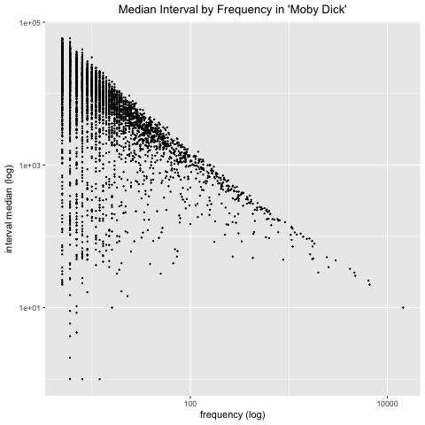

# Word Repetition
Examine relationship between word frequency and how close together those words appear

# How to Use
This repo currently loads text from Project Gutenberg using the R package [gutenbergr](https://cran.r-project.org/web/packages/gutenbergr/vignettes/intro.html). Its other dependencies are [`tokenizers`](https://cran.r-project.org/web/packages/tokenizers/index.html) and [`ggplot2`](https://cran.r-project.org/web/packages/ggplot2/index.html). If you need them, the install lines are commented out at the top of `word_repetition.R`:

	# install.packages("gutenbergr")
	# install.packages("tokenizers")
	# install.packages("ggplot2")

All the heavy lifting is done by [`lib/text_utils.R`](lib/text_utils.R), which is loaded at the top of the main script.

The code could easily be extended to also load local text files.

## Finding a Text

`lib/text_utils.R` automatically loads the Project Gutenberg catalog and reduces it down to English-language texts that are in the public domain. Use `get_ids([title])` to see a listing of titles on Project Gutenberg match the title you enter. There will often be multiple matches, like so:

	get_ids("Moby Dick")
	# [1] "Found 3 match(es) for Moby Dick"
	# [1] "--'Moby Dick' by Melville, Herman (id #15)"
	# [1] "--'Moby Dick; Or, The Whale' by Melville, Herman (id #2489)"
	# [1] "--'Moby Dick; Or, The Whale' by Melville, Herman (id #2701)"
	# [1] "Please choose one and enter the id in get_text()"

To load the text and tokenize it, feed the id of the text you want as a string into `get_text`:

	get_text("2489")
	# [1] "Loading 'Moby Dick; Or, The Whale' by Melville, Herman"
	# [1] "Found 216,060 words in 'Moby Dick; Or, The Whale'"

*Note:* Not all texts are available. If you try to load the _Moby Dick_ with id "15" you'll just get some metadata on the book, for example. The word count should tell you if you chose the right one.

## Calculating Intervals

Once you have the tokens, feed them to `get_intervals`, which will calculate the distance between each two consecutive appearances of two words for of every unique word in the text. The function takes a second argument that indicates the minimum number of times a word needs to appear in the text in order for it be counted. The default is 10, but you should knock it up for large texts or this function will take a _long_ time.

The function calculates every interval for every word. For example, a word that appears 10 times, at indices `[2, 45, 60, 100, 110, 200, 310, 340, 395, 406]` with have 9 intervals: `[43, 15, 40, 10, 90, 110, 30, 55, 11]`. But the data frame you get back with, for each word, currently reduce this list of intervals--which can be very long for words like "the"--to the median, mean, minimum, maximum and standard deviation.

## Plotting the Results

We you get `intervals` back, feed it to `plot_intervals` with the title of the book as a second argument to create scatterplots of all five of the above-mentioned indicators. If you give the function a third argument, to will create a director with that name in the `data/` directory and save images of each plot in the subdirectory.

# What I've Found

So far, the results only show what one might expect: That there is a strong inverse relationship between the frequency of a word and how far apart two instances typically appear. For example, here's a log plot of the median distance between words in _Moby Dick_ as a function of the word's frequency:

# Where to Go From Here

The next step is to example the outliers in the list of each word's intervals, particularly in places where reasonably uncommon words appear closer together than average (or median). It will not be difficult to trace these outliers back to the actual text where they appear, since the index of the interval matches the index of the words themselves.

